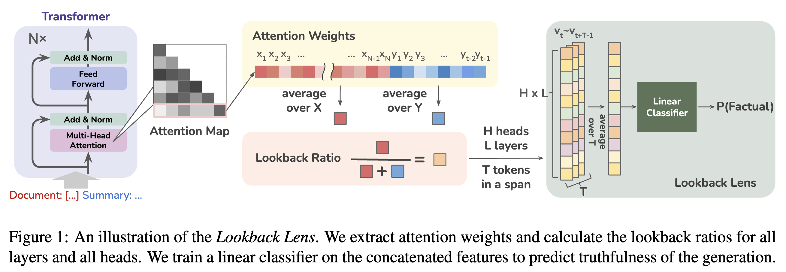

# Lookback Lens 🔎 🦙

Code for the paper **"Detecting and Mitigating Contextual Hallucinations in Large Language Models Using Only Attention Maps"**

Authors: [Yung-Sung Chuang](https://people.csail.mit.edu/yungsung/)$^\dagger$, [Linlu Qiu](https://linlu-qiu.github.io/)$^\dagger$, [Cheng-Yu Hsieh](https://chengyuhsieh.github.io/)$^\ddagger$, [Ranjay Krishna](https://ranjaykrishna.com/index.html)$^\ddagger$, [Yoon Kim](https://people.csail.mit.edu/yoonkim/)$^\dagger$, [James Glass](https://people.csail.mit.edu/jrg/)$^\dagger$  
$^\dagger$ Massachusetts Institute of Technology, $^\ddagger$ University of Washington

## Introduction

When asked to summarize articles or answer questions given a passage, large language models (LLMs) hallucinate details and respond with unsubstantiated answers that are inaccurate with respect to the input context.

This paper describes a simple approach for detecting such **contextual hallucinations**. We hypothesize that contextual hallucinations are related to the extent to which an LLM attends to information in the provided context versus its own generations. Based on this intuition, we propose a simple hallucination detection model whose input features are given by the ratio of attention weights on the context versus newly generated tokens (for each attention head).  We find that a linear classifier based on these **lookback ratio** features is as effective as a richer detector that utilizes the entire hidden states of an LLM or a text-based entailment model. 

The lookback ratio-based detector—**Lookback Lens**—is found to transfer across tasks and even models, allowing a detector that is trained on a 7B model to be applied (without retraining) to a larger 13B model.   

We further apply this detector to mitigate hallucination generations, and find that a simple classifier-guided sampling approach is able to reduce the amount of hallucinations. For example, the detector is able to reduce hallucinations by 9.6% in the XSum summarization task.




## Installation
```bash
pip install -r requirements.txt
pip install -e ./transformers-4.32.0
```

```
gzip -d data/nq-open-10_total_documents_gold_at_4.jsonl.gz
```

## Preparation 📚

**\*\*Hint: Skip step 01 & 02 by downloading the precomputed lookback ratios & annotations [here](https://www.dropbox.com/scl/fi/a87iv6xw9xma6ppc5pw2h/step1and2.tar.bz?rlkey=j382rsrwu2wnfwj7sn14ai3qw&dl=0).\*\***

### Step 01: Extracting Lookback Ratios from Attention Weights (NQ and CNN/DM) (Optional)
```bash
python step01_extract_attns.py --model-name meta-llama/Llama-2-7b-chat-hf/ --data-path data/nq-open-10_total_documents_gold_at_4.jsonl --output-path lookback-ratio-nq-7b.pt
python step01_extract_attns.py --model-name meta-llama/Llama-2-7b-chat-hf --data-path data/cnndm-1000.jsonl --output-path lookback-ratio-cnndm-7b.pt
```

### Step 02: Run GPT-4o Annotation (NQ and CNN/DM) (Optional)
```bash
OPENAI_API_KEY={your_key} python step02_eval_gpt4o.py --hyp lookback-ratio-nq-7b.pt --ref data/nq-open-10_total_documents_gold_at_4.jsonl --out anno-nq-7b.jsonl
OPENAI_API_KEY={your_key} python step02_eval_gpt4o.py --hyp lookback-ratio-cnndm-7b.pt --ref data/xsum-1000.jsonl --out anno-cnndm-7b.jsonl
```

## Logistic Regression Classifiers (Lookback Lens) 📈


### Step 03: Fitting Lookback Lens Classifiers (NQ and CNN/DM)
```bash
# Predefined Span
python step03_lookback_lens.py --anno_1 anno-nq-7b.jsonl --anno_2 anno-cnndm-7b.jsonl --lookback_ratio_1 lookback-ratio-nq-7b.pt --lookback_ratio_2 lookback-ratio-cnndm-7b.pt
# Sliding Window (=8)
python step03_lookback_lens.py --anno_1 anno-nq-7b.jsonl --anno_2 anno-cnndm-7b.jsonl --lookback_ratio_1 lookback-ratio-nq-7b.pt --lookback_ratio_2 lookback-ratio-cnndm-7b.pt --sliding_window 8
```

The output will be similar to:
```
# Predefined Span

======== Results:
                  , Train AUROC (on A), Test AUROC (on A), Transfer AUROC (on B)
A=nq-7b;B=cnndm-7b, 0.9867235784623354, 0.9140908050233869, 0.8526936562673579
A=cnndm-7b;B=nq-7b, 0.9844307377081996, 0.8720309189629751, 0.8203155443540785

# Sliding Window (=8)

======== Results:
                  , Train AUROC (on A), Test AUROC (on A), Transfer AUROC (on B)
A=nq-7b;B=cnndm-7b, 0.8858071459740011, 0.8663781955546325, 0.6624004639123215
A=cnndm-7b;B=nq-7b, 0.8650978795284527, 0.8474340844981891, 0.6608756591251488
```


## Inference 🏃
### Step 04: Run Greedy vs Classifier Guided Decoding (NQ and XSum)

We perform decoding with `classifiers/classifier_anno-cnndm-7b_sliding_window_8.pkl` for both tasks to test the in-domain (XSum) and out-of-domain (NQ) performance of the Lookback Lens Guided Decoding.

```bash
# Greedy (NQ)
python step04_run_decoding.py --model-name meta-llama/Llama-2-7b-chat-hf/ --data-path data/nq-open-10_total_documents_gold_at_4.jsonl --output-path output-nq-open-greedy-decoding.jsonl --num-gpus 1
# Lookback Lens Guided Decoding (NQ)
python step04_run_decoding.py --model-name meta-llama/Llama-2-7b-chat-hf/ --data-path data/nq-open-10_total_documents_gold_at_4.jsonl --output-path output-nq-open-lookback-decoding.jsonl --num-gpus 1 --do_sample --guiding-classifier classifiers/classifier_anno-cnndm-7b_sliding_window_8.pkl --chunk-size 8 --num-candidates 8 
```


```bash
# Greedy (XSum)
python step04_run_decoding.py --model-name meta-llama/Llama-2-7b-chat-hf/ --data-path data/xsum-1000.jsonl --output-path output-xsum-greedy-decoding.jsonl --num-gpus 1
# Lookback Lens Guided Decoding (XSum)
python step04_run_decoding.py --model-name meta-llama/Llama-2-7b-chat-hf/ --data-path data/xsum-1000.jsonl --output-path output-xsum-lookback-decoding.jsonl --num-gpus 1 --do_sample --guiding-classifier classifiers/classifier_anno-cnndm-7b_sliding_window_8.pkl --chunk-size 8 --num-candidates 8 
```

#### If too slow: Parallel (Sharded) Inference

Running inference in sharded mode can be done by setting `--parallel --total-shard 4 --shard-id 0` for the first shard, `--parallel --total-shard 4 --shard-id 1` for the second shard, and so on. The dataset will be split into 4 shards and the inference of each shard can be run in parallel.

## Evaluation 📊

### Run Exact Match Evaluation (NQ)
```bash
python eval_exact_match.py --hyp output-nq-open-greedy-decoding.jsonl --ref data/nq-open-10_total_documents_gold_at_4.jsonl
python eval_exact_match.py --hyp output-nq-open-lookback-decoding.jsonl --ref data/nq-open-10_total_documents_gold_at_4.jsonl
```

The output will be similar to:
```
# Greedy
Best span EM: 0.711864406779661
# Lookback Lens Guided Decoding
Best span EM: 0.7419962335216572 (by random sampling so the result may vary)
```

### Run GPT-4o Evaluation (XSum)
```bash
OPENAI_API_KEY={your_key} python step02_eval_gpt4o.py --hyp output-xsum-greedy-decoding.jsonl --ref data/xsum-1000.jsonl --out record-gpt4o-eval-xsum-greedy-decoding.jsonl 
OPENAI_API_KEY={your_key} python step02_eval_gpt4o.py --hyp output-xsum-lookback-decoding.jsonl --ref data/xsum-1000.jsonl --out record-gpt4o-eval-xsum-lookback-decoding.jsonl 
```

The output will be similar to:
```
# Greedy
Accuracy: 0.490
# Lookback Lens Guided Decoding
Accuracy: 0.586
(the result may vary due to the randomness of GPT-4o API and the randomness of sampling)
```

# Citation

Please cite our paper if it's helpful to your work!

```
@article{chuang2024lookback,
  title={Lookback Lens: Detecting and Mitigating Contextual Hallucinations in Large Language Models Using Only Attention Maps},
  author={Chuang, Yung-Sung and Qiu, Linlu and Hsieh, Cheng-Yu and Krishna, Ranjay and Kim, Yoon and Glass, James},
  journal={arXiv preprint arXiv:2024},
  year={2024},
}
```